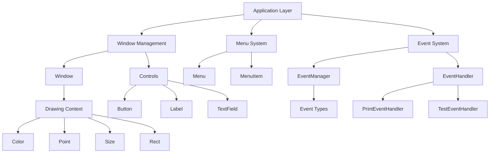

# Architecture

## Overview

Cocoanut is a Rust wrapper for Cocoa that provides a safe, idiomatic interface to macOS GUI development. The architecture is designed to be modular, testable, and maintainable while providing a clean API for developers.

## System Architecture

## Module Structure

### Core Modules

#### `application.rs`
- **Purpose**: Manages the main application lifecycle
- **Key Components**:
  - `Application`: Main application class
  - Handles app initialization and termination
  - Manages the main event loop

#### `window.rs`
- **Purpose**: Window management and creation
- **Key Components**:
  - `Window`: Native macOS window wrapper
  - Handles window properties (title, size, visibility)
  - Manages window lifecycle

#### `menu.rs`
- **Purpose**: Menu system implementation
- **Key Components**:
  - `Menu`: Menu container
  - `MenuItem`: Individual menu items
  - Supports separators and actions

#### `controls.rs`
- **Purpose**: UI controls and widgets
- **Key Components**:
  - `Button`: Clickable button control with builder pattern
  - `Label`: Text display control with styling
  - `TextField`: Text input control with editing
- **Features**:
  - Builder patterns for fluent API
  - `as_view()` method for window integration
  - Proper NSString conversion for text

#### `events.rs`
- **Purpose**: Event handling system
- **Key Components**:
  - `Event`: Event type definitions
  - `EventHandler`: Trait for event processing
  - `EventManager`: Coordinates event handling
  - `TestEventHandler`: Testing utilities

#### `drawing.rs`
- **Purpose**: Drawing and graphics utilities
- **Key Components**:
  - `Color`: Color representation
  - `Point`: 2D point
  - `Size`: 2D size
  - `Rect`: 2D rectangle
  - `DrawingContext`: Drawing operations

#### `error.rs`
- **Purpose**: Error handling and types
- **Key Components**:
  - `CocoanutError`: Error type definitions
  - `Result<T>`: Result type alias
  - Error conversion implementations

#### `simple_app.rs`
- **Purpose**: High-level application API with minimal boilerplate
- **Key Components**:
  - `SimpleApp`: Builder for creating macOS apps
  - Fluent API: `.title()`, `.size()`, `.centered()`, `.with_window()`, `.run()`
  - Automatic component creation and display
- **Features**:
  - NSApplication initialization
  - Window creation and configuration
  - Component creation (Button, Label, TextField)
  - Event loop management
  - Automatic component positioning

#### `utils.rs`
- **Purpose**: Utility functions and helpers
- **Key Components**:
  - String conversion utilities
  - Object management helpers
  - Threading utilities
  - Logging functions

## GUI Component Display System

### Component Lifecycle
1. **NSApplication Initialization** - `SimpleApp::run()` creates NSApplication
2. **Window Creation** - Window is created with specified dimensions
3. **Component Creation** - Components (Button, Label, TextField) created after NSApplication init
4. **Component Positioning** - Components positioned with hardcoded frames
5. **Window Display** - Window made visible with components
6. **Event Loop** - NSApplication runs main event loop

### Key Insight: NSApplication Context
- NSView components MUST be created within NSApplication context
- Creating components before NSApplication initialization causes crashes
- Solution: Move component creation to SimpleApp::run() after NSApplication.sharedApplication

### Component Integration
- `Window::add_subview()` - Adds components to window's content view
- `Component::as_view()` - Returns NSView pointer for window integration
- Automatic frame setting and visibility configuration

## Design Patterns

### Wrapper Pattern
Each Cocoa class is wrapped in a Rust struct that provides:
- Memory safety through Rust's ownership system
- Error handling for Objective-C operations
- Idiomatic Rust API

### Builder Pattern
- `WindowBuilder`, `ButtonBuilder`, `LabelBuilder`, `TextFieldBuilder`
- Fluent API for configuration
- Type-safe component creation

### Trait-Based Design
- `EventHandler` trait for event processing
- Extensible and testable architecture
- Allows for custom event handling implementations

### Error Handling
- Comprehensive error types for different failure modes
- Result-based error handling throughout
- Clear error messages and context

## Memory Management

### Objective-C Integration
- Uses `objc` crate for safe Objective-C interop
- Proper retain/release cycle management
- Automatic cleanup in `Drop` implementations

### Rust Safety
- All Objective-C objects are wrapped in Rust structs
- Ownership is clearly defined
- No raw pointer exposure in public API

## Threading Model

### Main Thread Operations
- GUI operations must occur on the main thread
- Utilities provided for thread safety checks
- Event handling is thread-safe

### Event Processing
- Events are processed synchronously
- Event handlers can be added/removed dynamically
- Thread-safe event manager implementation

## Testing Strategy

### Unit Tests
- Each module has comprehensive unit tests
- Tests cover error conditions and edge cases
- Mock objects for testing event handling

### Integration Tests
- End-to-end testing of complete workflows
- Snapshot testing for UI components
- Performance testing for critical paths

### Test Utilities
- `TestEventHandler` for event testing
- `PrintEventHandler` for debugging
- Helper functions for common test scenarios

## Error Handling Strategy

### Error Types
- Specific error types for different failure modes
- Contextual error messages
- Error conversion from system errors

### Error Propagation
- Result-based error handling
- Early return on errors
- Clear error messages for debugging

## Performance Considerations

### Memory Usage
- Efficient object management
- Minimal overhead over native Cocoa
- Proper cleanup and resource management

### Runtime Performance
- Direct Objective-C calls where possible
- Minimal abstraction overhead
- Efficient event processing

## Security Considerations

### Memory Safety
- Rust's ownership system prevents common bugs
- No raw pointer exposure
- Safe string handling

### Input Validation
- Parameter validation for all public APIs
- Safe string conversion
- Bounds checking for drawing operations

## Future Architecture Considerations

### Extensibility
- Modular design allows for easy extension
- Trait-based system for custom implementations
- Plugin architecture potential

### Cross-Platform
- Current design is macOS-specific
- Could be extended for other platforms
- Abstraction layer potential

### Performance Optimization
- Lazy initialization where appropriate
- Caching for frequently accessed objects
- Batch operations for multiple updates

## Dependencies

### Core Dependencies
- `objc`: Objective-C interop
- `cocoa`: Cocoa framework bindings
- `core-graphics`: Graphics operations
- `core-foundation`: Foundation framework
- `dispatch`: Grand Central Dispatch

### Development Dependencies
- `criterion`: Performance benchmarking
- `insta`: Snapshot testing
- `thiserror`: Error handling utilities

## Build Configuration

### Cargo Features
- Default features for core functionality
- Optional features for advanced capabilities
- Feature flags for different use cases

### Compilation
- Rust edition 2024
- Optimized release builds
- Debug symbols for development
- LTO for release builds

## Documentation Strategy

### API Documentation
- Comprehensive doc comments
- Examples for all public APIs
- Error handling documentation

### User Guides
- Getting started guide
- Advanced usage examples
- Best practices documentation

### Architecture Documentation
- This document for high-level architecture
- Module-level documentation
- Design decision records
