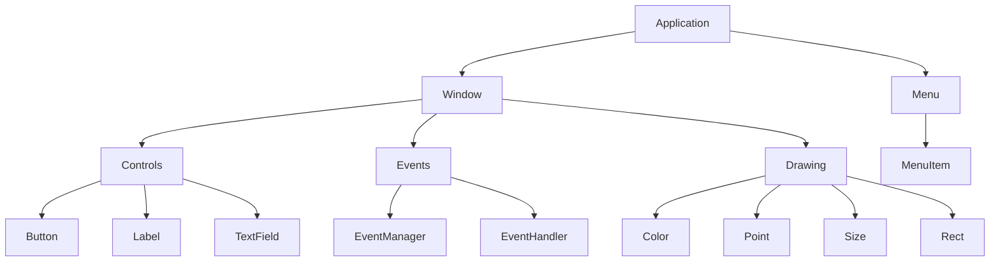

# Cocoanut

<image src="cocoanut.png"></image>

A Rust wrapper for Cocoa to develop macOS-specific GUI applications.

[](LICENSE)
[](https://blog.rust-lang.org/2024/12/19/rust-2024.html)
[](https://crates.io/crates/cocoanut)

## Features

- **Builder Patterns**: Fluent, chainable API for creating UI components
- **Layout System**: VStack/HStack for declarative UI composition
- **Carbon Design System**: Professional styling and theming out of the box
- **Window Management**: Create and manage native macOS windows
- **Menu System**: Build application menus and context menus
- **Controls**: Native macOS UI controls and widgets
- **Event Handling**: Comprehensive event system for user interactions
- **Drawing**: Core Graphics integration for custom drawing
- **Thread Safety**: Safe cross-thread operations
- **Memory Safe**: Rust's ownership system prevents common GUI bugs

## Comparison with Other Rust GUI Crates

Cocoanut is designed as an educational wrapper around Cocoa, positioned between raw Objective-C calls and high-level frameworks. Here's how it compares to other Rust crates for macOS GUI development:

### **objc** (Original)
- **Level**: Very low-level, raw FFI
- **Features**: Direct access to Objective-C runtime, manual memory management
- **Use Case**: System programming, performance-critical apps
- **Example**:
```rust
use objc::{msg_send, sel, class};
let app: *mut Object = msg_send![class!(NSApplication), sharedApplication];
```

### **objc2** (Modern Successor)
- **Level**: Low-level but with better safety
- **Features**: Improved memory safety, better error handling, ARC support
- **Use Case**: When you want low-level control with better safety
- **Example**:
```rust
use objc2::{msg_send, sel, class};
let app: *mut Object = msg_send![class!(NSApplication), sharedApplication];
```

### **cocoa** (Mid-level Wrapper)
- **Level**: Medium-level abstraction
- **Features**: Pre-built wrappers for common Cocoa classes, some memory management automation
- **Use Case**: When you want some abstraction but still need control
- **Example**:
```rust
use cocoa::appkit::{NSApplication, NSWindow};
let app = NSApplication::sharedApplication();
```

### **cacao** (High-level Framework)
- **Level**: High-level abstraction
- **Features**: Rust-native API design, automatic memory management, cross-platform
- **Use Case**: Modern apps, cross-platform development
- **Example**:
```rust
use cacao::appkit::{App, AppDelegate, Window};

struct MyApp;
impl AppDelegate for MyApp {
    fn did_finish_launching(&self) {
        let window = Window::new("My App", 800.0, 600.0);
        window.show();
    }
}
```

### **cocoanut** (Our Crate)
- **Level**: Low to mid-level abstraction with high-level ergonomics
- **Features**: Builder patterns, layout system, Carbon Design System, fluent API, educational approach
- **Use Case**: Learning Cocoa development, rapid prototyping, modern Rust GUI apps
- **Example**:
```rust
use cocoanut::prelude::*;

let app = Application::new("My App")?;
let window = Window::new("My Window", 800.0, 600.0)?;

let button = Button::builder()
    .title("Click me")
    .size(100.0, 50.0)
    .build()?;

let vstack = VStack::new()
    .spacing(Spacing::standard())
    .alignment(Alignment::Center);
```

### Comparison Table

| Crate | Level | Safety | Learning Curve | Performance | Maintenance |
|-------|-------|--------|----------------|-------------|-------------|
| `objc` | Very Low | Low | High | Highest | Active |
| `objc2` | Low | Medium | High | High | Active |
| `cocoa` | Medium | Medium | Medium | High | Stagnant |
| `cacao` | High | High | Low | Medium | Active |
| `cocoanut` | Low-Medium | High | Low | High | Active |

### Recommendation

- **For learning**: Start with `cocoanut` or `cacao`
- **For production**: Use `cacao` for modern apps, `objc2` for performance-critical apps
- **For legacy**: Use `cocoa` if you need specific Cocoa features
- **For system programming**: Use `objc` or `objc2`

## What Makes Cocoanut Different?

### Simplified API Over Raw objc/cocoa

Cocoanut provides **idiomatic Rust abstractions** that make GUI development easier:

- **Builder Patterns**: Fluent API instead of multiple method calls
- **Layout System**: Declarative VStack/HStack instead of manual positioning
- **Design System**: Carbon Design System colors and typography built-in
- **Type Safety**: No raw pointers or unsafe code in public API

See [SIMPLIFICATION_GUIDE.md](docs/SIMPLIFICATION_GUIDE.md) for detailed comparisons.

## Quick Start

Add Cocoanut to your `Cargo.toml`:

```toml
[dependencies]
cocoanut = "0.1.0"
```

Create a simple window:

```rust
use cocoanut::prelude::*;

fn main() -> Result<(), Box<dyn std::error::Error>> {
    let app = Application::new("My App")?;
    let window = Window::new("My Window", 800.0, 600.0)?;
    
    app.run(window)?;
    Ok(())
}
```

Create UI with builders and layout:

```rust
use cocoanut::prelude::*;

let button = Button::builder()
    .title("Click Me")
    .size(100.0, 50.0)
    .build()?;

let label = Label::builder()
    .text("Hello, Cocoanut!")
    .build()?;

let vstack = VStack::new()
    .spacing(Spacing::standard())
    .alignment(Alignment::Center);
```

## Architecture



## Examples

### Basic Window

```rust
use cocoanut::prelude::*;

fn main() -> Result<(), Box<dyn std::error::Error>> {
    let app = Application::new("Basic Window")?;
    let window = Window::new("Hello, Cocoanut!", 800.0, 600.0)?;
    
    window.show()?;
    app.run(window)?;
    Ok(())
}
```

### Menu Application

```rust
use cocoanut::prelude::*;

fn main() -> Result<(), Box<dyn std::error::Error>> {
    let app = Application::new("Menu App")?;
    let window = Window::new("Menu App", 600.0, 400.0)?;
    
    // Create menu bar
    let menu_bar = Menu::new("Main Menu")?;
    
    // Create File menu
    let file_menu = Menu::new("File")?;
    let new_item = MenuItem::new("New", Some("newDocument:"))?;
    let quit_item = MenuItem::new("Quit", Some("terminate:"))?;
    
    file_menu.add_item(new_item)?;
    file_menu.add_item(quit_item)?;
    menu_bar.add_item(file_menu)?;
    
    window.show()?;
    app.run(window)?;
    Ok(())
}
```

### Controls

```rust
use cocoanut::prelude::*;

fn main() -> Result<(), Box<dyn std::error::Error>> {
    let app = Application::new("Controls App")?;
    let window = Window::new("Controls", 400.0, 300.0)?;
    
    // Create controls
    let button = Button::new("Click Me")?;
    let label = Label::new("Hello, World!")?;
    let text_field = TextField::new("Enter text...")?;
    
    window.show()?;
    app.run(window)?;
    Ok(())
}
```

### Custom Drawing

```rust
use cocoanut::prelude::*;

fn main() -> Result<(), Box<dyn std::error::Error>> {
    let app = Application::new("Drawing App")?;
    let window = Window::new("Drawing", 600.0, 400.0)?;
    
    // Create drawing context
    let context = DrawingContext::new()?;
    
    // Set colors
    let red = Color::red();
    let blue = Color::blue();
    
    // Draw rectangles
    context.set_fill_color(red)?;
    context.fill_rect(Rect::from_xywh(10.0, 10.0, 100.0, 100.0))?;
    
    context.set_fill_color(blue)?;
    context.fill_rect(Rect::from_xywh(120.0, 10.0, 100.0, 100.0))?;
    
    window.show()?;
    app.run(window)?;
    Ok(())
}
```

## API Reference

### Application

The main application class for managing the macOS application lifecycle.

```rust
let app = Application::new("My App")?;
app.run(window)?;
```

### Window

Create and manage native macOS windows.

```rust
let window = Window::new("Title", 800.0, 600.0)?;
window.show()?;
window.set_title("New Title")?;
window.set_size(1000.0, 700.0)?;
```

### Menu System

Build application menus and context menus.

```rust
let menu = Menu::new("File")?;
let item = MenuItem::new("New", Some("newDocument:"))?;
menu.add_item(item)?;
```

### Controls

Native macOS UI controls and widgets.

```rust
let button = Button::new("Click Me")?;
let label = Label::new("Hello, World!")?;
let text_field = TextField::new("Enter text...")?;
```

### Drawing

Core Graphics integration for custom drawing.

```rust
let context = DrawingContext::new()?;
let color = Color::rgb(1.0, 0.0, 0.0)?;
let rect = Rect::from_xywh(10.0, 10.0, 100.0, 100.0)?;

context.set_fill_color(color)?;
context.fill_rect(rect)?;
```

### Events

Comprehensive event system for user interactions.

```rust
let mut manager = EventManager::new();
manager.add_handler(Box::new(MyEventHandler::new()));

let event = Event::ButtonClick;
manager.process_event(event)?;
```

## Requirements

- macOS 10.15 or later
- Rust 1.70 or later
- Xcode command line tools

## Building

```bash
cargo build
```

## Running Examples

```bash
cargo run --example basic_window
cargo run --example menu_app
```

## Testing

```bash
cargo test
```

## Contributing

Contributions are welcome! Please feel free to submit a Pull Request.

## License

This project is licensed under the Apache License 2.0 - see the [LICENSE](LICENSE) file for details.

## Changelog

### 0.1.0
- Initial release
- Basic window management
- Menu system
- UI controls (Button, Label, TextField)
- Event handling
- Drawing utilities
- Comprehensive test suite
